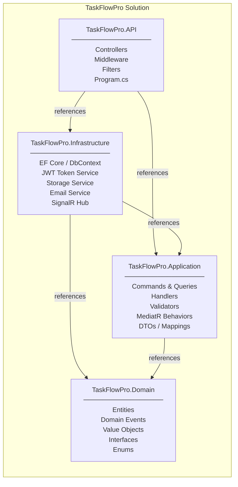
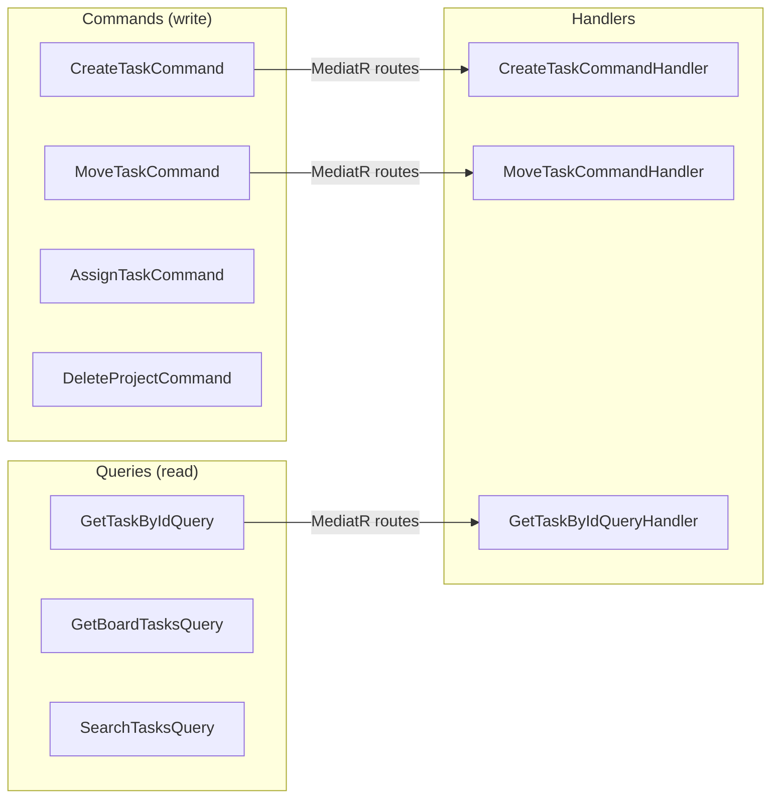
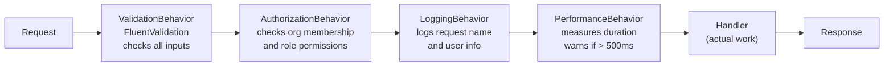
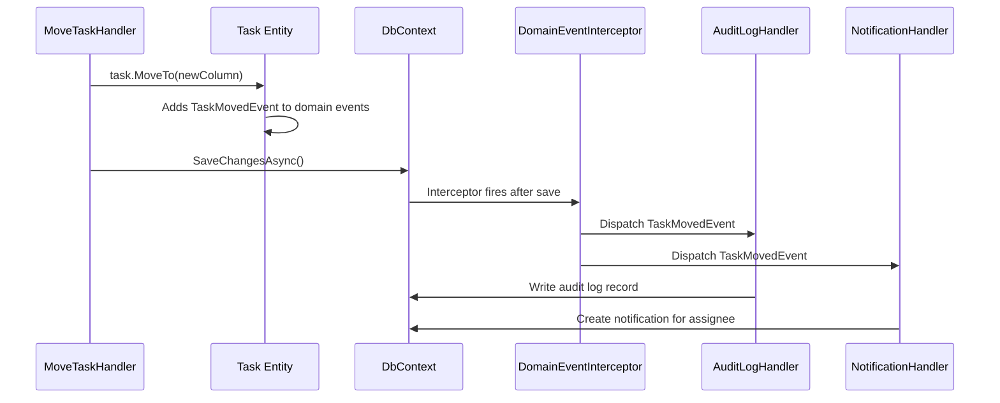
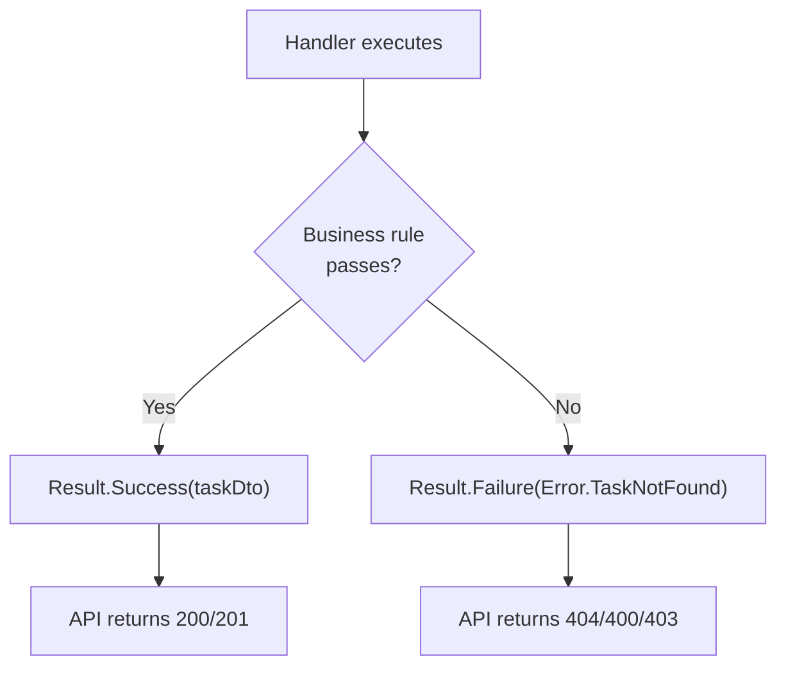

# Backend Architecture

## Clean Architecture

The backend is organized in four projects following Clean Architecture (also called Onion Architecture):



---

## CQRS with MediatR

Every operation in the system is either a **Command** (changes state) or a **Query** (reads state):



### What a Command looks like

```csharp
// The command - just data, no logic
public record CreateTaskCommand(
    Guid ProjectId,
    Guid BoardColumnId,
    string Title,
    TaskPriority Priority
) : IRequest<Result<TaskDto>>;

// The handler - all the logic lives here
public class CreateTaskCommandHandler : IRequestHandler<CreateTaskCommand, Result<TaskDto>>
{
    public async Task<Result<TaskDto>> Handle(CreateTaskCommand request, CancellationToken ct)
    {
        // 1. Validate business rules
        // 2. Create domain entity
        // 3. Save to database
        // 4. Return result
    }
}
```

---

## MediatR Pipeline Behaviors

Before the handler runs, every command/query passes through a pipeline of behaviors:



**Why this matters:** You write this logic ONCE and it applies to every command automatically. No copy-pasting validation logic into every controller.

---

## Domain Events

Domain Events decouple side effects from business logic:



**Key insight:** `MoveTaskHandler` has zero knowledge of audit logs or notifications. Adding a new side effect (like sending an email) means creating a new event handler — the existing handler doesn't change.

---

## Result Pattern

Business rule failures use the Result pattern instead of exceptions:



Exceptions are only for unexpected technical failures (database down, null reference, etc.), not for expected business scenarios like "task not found" or "user not authorized."

---

## Project Folder Structure

```
backend/
└── src/
    ├── TaskFlowPro.Domain/
    │   ├── Common/
    │   │   ├── BaseEntity.cs           # Id, CreatedAt, UpdatedAt
    │   │   ├── Result.cs               # Result<T> pattern
    │   │   └── IDomainEvent.cs
    │   ├── Entities/
    │   │   ├── Organization.cs
    │   │   ├── User.cs
    │   │   ├── Project.cs
    │   │   ├── Board.cs
    │   │   ├── BoardColumn.cs
    │   │   ├── Task.cs
    │   │   ├── Comment.cs
    │   │   └── AuditLog.cs
    │   ├── Events/
    │   │   ├── TaskCreatedEvent.cs
    │   │   ├── TaskMovedEvent.cs
    │   │   └── TaskAssignedEvent.cs
    │   └── Enums/
    │       ├── TaskPriority.cs
    │       ├── TaskStatus.cs
    │       └── OrganizationRole.cs
    │
    ├── TaskFlowPro.Application/
    │   ├── Common/
    │   │   ├── Behaviors/
    │   │   │   ├── ValidationBehavior.cs
    │   │   │   ├── AuthorizationBehavior.cs
    │   │   │   ├── LoggingBehavior.cs
    │   │   │   └── PerformanceBehavior.cs
    │   │   └── Interfaces/
    │   │       ├── IApplicationDbContext.cs
    │   │       └── ICurrentUserService.cs
    │   └── Features/
    │       ├── Auth/
    │       │   ├── Commands/Login/
    │       │   ├── Commands/Register/
    │       │   └── Commands/RefreshToken/
    │       ├── Tasks/
    │       │   ├── Commands/CreateTask/
    │       │   │   ├── CreateTaskCommand.cs
    │       │   │   ├── CreateTaskCommandHandler.cs
    │       │   │   └── CreateTaskCommandValidator.cs
    │       │   ├── Commands/MoveTask/
    │       │   └── Queries/GetTaskById/
    │       └── Projects/
    │
    ├── TaskFlowPro.Infrastructure/
    │   ├── Persistence/
    │   │   ├── ApplicationDbContext.cs
    │   │   ├── Configurations/          # EF Core Fluent API configs
    │   │   ├── Interceptors/
    │   │   │   ├── AuditableEntityInterceptor.cs
    │   │   │   └── DomainEventInterceptor.cs
    │   │   └── Migrations/
    │   ├── Identity/
    │   │   └── JwtTokenService.cs
    │   ├── Services/
    │   │   ├── CurrentUserService.cs
    │   │   └── TenantService.cs
    │   └── Hubs/
    │       └── NotificationHub.cs
    │
    └── TaskFlowPro.API/
        ├── Controllers/
        │   ├── AuthController.cs
        │   ├── ProjectsController.cs
        │   ├── TasksController.cs
        │   └── CommentsController.cs
        ├── Middleware/
        │   ├── ExceptionHandlingMiddleware.cs
        │   └── TenantResolutionMiddleware.cs
        └── Program.cs
```
