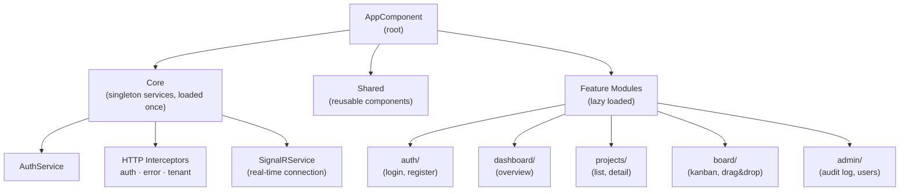
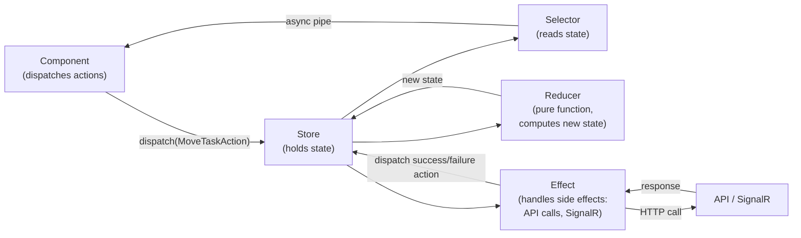
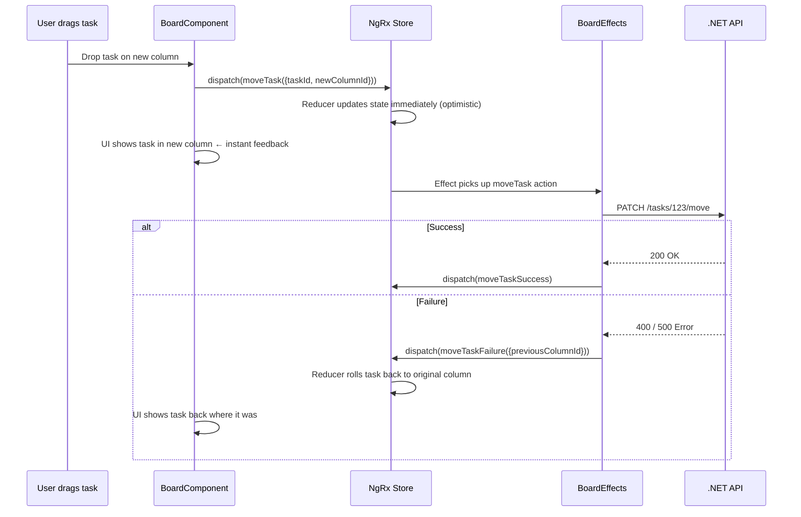
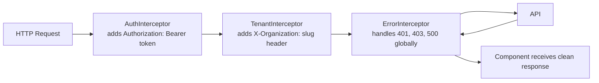
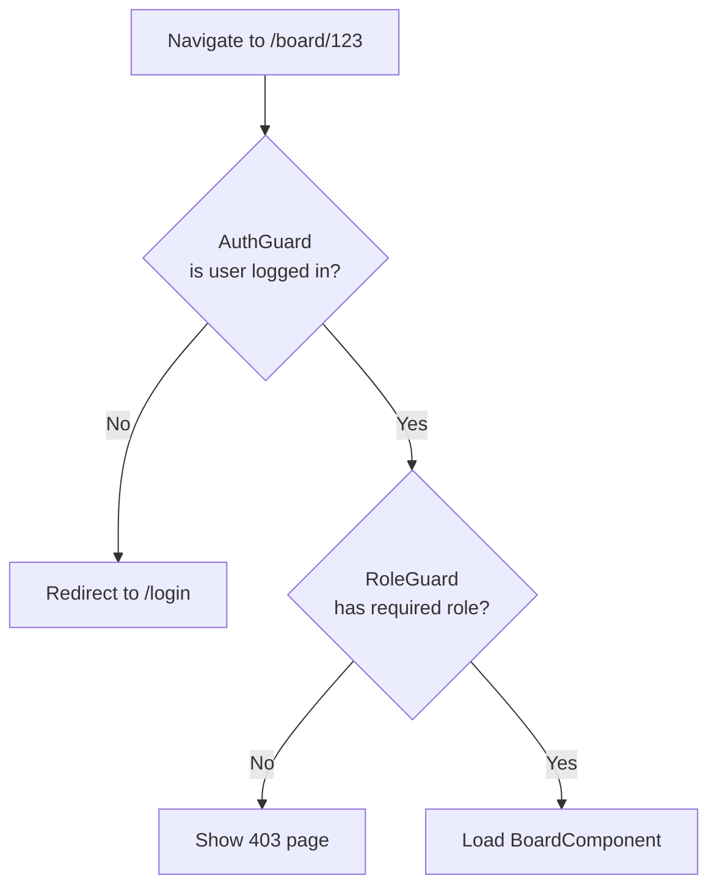
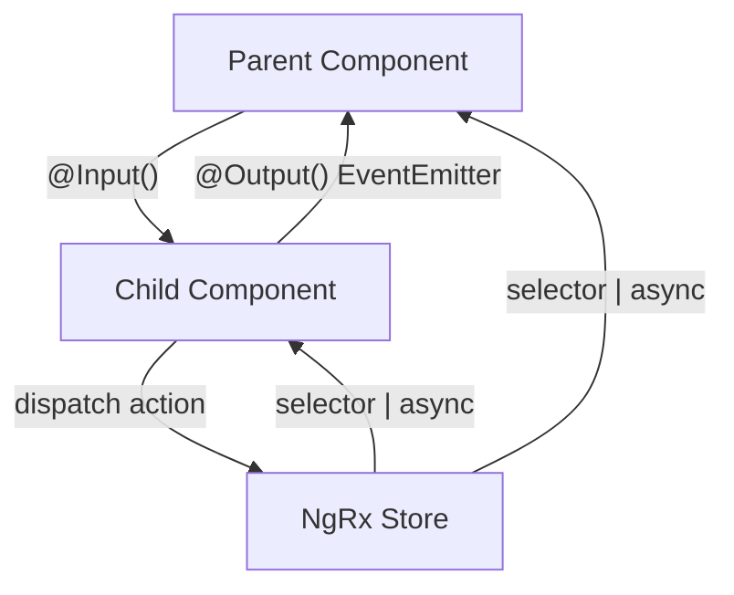

# Frontend Architecture

## Angular 19 with Standalone Components

This project uses Angular 19 with **standalone components** (no NgModules for features). All state is managed with NgRx.

---

## Application Structure



---

## NgRx Data Flow

NgRx enforces a **unidirectional data flow**. This makes the app predictable and debuggable:



### Optimistic Updates (the impressive pattern)

When a user drags a task to a new column:



---

## HTTP Interceptors

Interceptors run automatically on every HTTP request:



---

## Route Guards



---

## Folder Structure

```
frontend/
└── src/
    └── app/
        ├── core/                         # Singleton - imported once in app.config.ts
        │   ├── auth/
        │   │   ├── auth.service.ts       # login, logout, token management
        │   │   ├── auth.guard.ts         # protects routes requiring login
        │   │   └── role.guard.ts         # protects routes requiring a role
        │   ├── interceptors/
        │   │   ├── auth.interceptor.ts   # attaches Bearer token to every request
        │   │   ├── tenant.interceptor.ts # attaches org header to every request
        │   │   └── error.interceptor.ts  # global error handling (401 → logout, etc.)
        │   └── services/
        │       └── signalr.service.ts    # manages SignalR connection lifecycle
        │
        ├── shared/                       # Reusable across features
        │   ├── components/
        │   │   ├── avatar/               # User avatar with initials fallback
        │   │   ├── confirm-dialog/       # "Are you sure?" modal
        │   │   ├── empty-state/          # Illustration + message when no data
        │   │   ├── loading-spinner/
        │   │   └── priority-icon/        # Colored icon for task priority
        │   ├── directives/
        │   │   └── has-role.directive.ts # *hasRole="'admin'" — hides element if no role
        │   └── pipes/
        │       ├── time-ago.pipe.ts      # "3 minutes ago"
        │       └── file-size.pipe.ts     # "2.4 MB"
        │
        ├── features/
        │   ├── auth/                     # Lazy loaded
        │   │   ├── login/
        │   │   │   ├── login.component.ts
        │   │   │   └── login.component.html
        │   │   ├── register/
        │   │   └── auth.routes.ts
        │   │
        │   ├── board/                    # Most complex feature
        │   │   ├── board.component.ts    # Main kanban board
        │   │   ├── board-column/         # A single column
        │   │   ├── task-card/            # A task card (draggable)
        │   │   ├── task-detail/          # Slide-over panel with full task info
        │   │   │   ├── task-comments/
        │   │   │   └── task-attachments/
        │   │   └── board.routes.ts
        │   │
        │   └── admin/                    # Role-gated feature
        │       ├── audit-log/
        │       └── admin.routes.ts
        │
        └── store/                        # NgRx state management
            ├── app.state.ts              # Root state interface
            ├── auth/
            │   ├── auth.actions.ts       # login, loginSuccess, loginFailure, logout
            │   ├── auth.effects.ts       # calls API, dispatches success/failure
            │   ├── auth.reducer.ts       # pure function: state + action = new state
            │   └── auth.selectors.ts     # selectCurrentUser, selectIsAuthenticated
            ├── board/
            │   ├── board.actions.ts      # loadBoard, moveTask, moveTaskSuccess...
            │   ├── board.effects.ts      # API calls, SignalR event dispatch
            │   ├── board.reducer.ts      # handles optimistic updates + rollback
            │   └── board.selectors.ts    # selectColumns, selectTasksByColumn
            └── notifications/
                └── ...
```

---

## Component Communication Pattern



**Rule:** Components do not call services directly for data. They dispatch actions and select from the store. Services are only called from NgRx Effects.
