# System Architecture Overview

## The Big Picture

TaskFlow Pro is split into two independent applications that communicate over HTTP and WebSockets:

```mermaid
graph TB
    subgraph Client["Browser"]
        Angular["Angular 19 SPA<br/>NgRx · Material · CDK"]
    end

    subgraph API["Backend (.NET 9)"]
        Controller["API Controllers"]
        MediatR["MediatR Pipeline<br/>(Validation · Auth · Logging)"]
        Handlers["Command & Query Handlers"]
        Domain["Domain Layer<br/>(Entities · Events · Rules)"]
        EF["Entity Framework Core 9"]
        SignalR["SignalR Hub"]
    end

    subgraph Data["Data Layer"]
        PG["PostgreSQL 16<br/>(primary data)"]
        Redis["Redis<br/>(cache · SignalR backplane)"]
        MinIO["MinIO<br/>(file storage)"]
    end

    Angular -->|"HTTPS REST"| Controller
    Angular <-->|"WebSocket"| SignalR
    Controller --> MediatR
    MediatR --> Handlers
    Handlers --> Domain
    Handlers --> EF
    EF --> PG
    SignalR --> Redis
    Handlers -->|"files"| MinIO
```

---

## Request Lifecycle (Backend)

Every API request follows the same path through the system:

**Key insight:** The handler only handles business logic. Everything else (validation, auth, logging) is handled by the pipeline automatically for every command.

---

## The Four Layers

```mermaid
graph LR
    API["🌐 API Layer<br/>Controllers<br/>Middleware<br/>Filters"]
    APP["⚙️ Application Layer<br/>Commands & Queries<br/>Handlers<br/>DTOs"]
    DOM["💎 Domain Layer<br/>Entities<br/>Domain Events<br/>Business Rules"]
    INF["🔧 Infrastructure Layer<br/>EF Core<br/>JWT<br/>Storage<br/>Email"]

    API --> APP
    APP --> DOM
    INF --> APP
    INF --> DOM
```

### Dependency Rule
**The dependency always points inward.** Domain knows nothing about Entity Framework. Application knows nothing about HTTP. This is what makes the code testable and maintainable.

| Layer | Knows about | Does NOT know about |
|---|---|---|
| Domain | Nothing external | EF Core, HTTP, SignalR |
| Application | Domain only | EF Core, HTTP |
| Infrastructure | Domain + Application | HTTP controllers |
| API | All layers | — |

---

## Multi-Tenancy Strategy

Every organization's data is isolated at the **query level** using EF Core Global Query Filters:

A developer cannot forget to filter by tenant — EF Core adds the `WHERE organization_id = ?` clause automatically to every query.

---

## Real-time Architecture

---

## Further Reading

- [Backend Architecture](backend.md) — Clean Architecture layers in detail
- [Frontend Architecture](frontend.md) — Angular modules and NgRx data flow
- [Database ERD](../database/erd.md) — Full entity-relationship diagram
