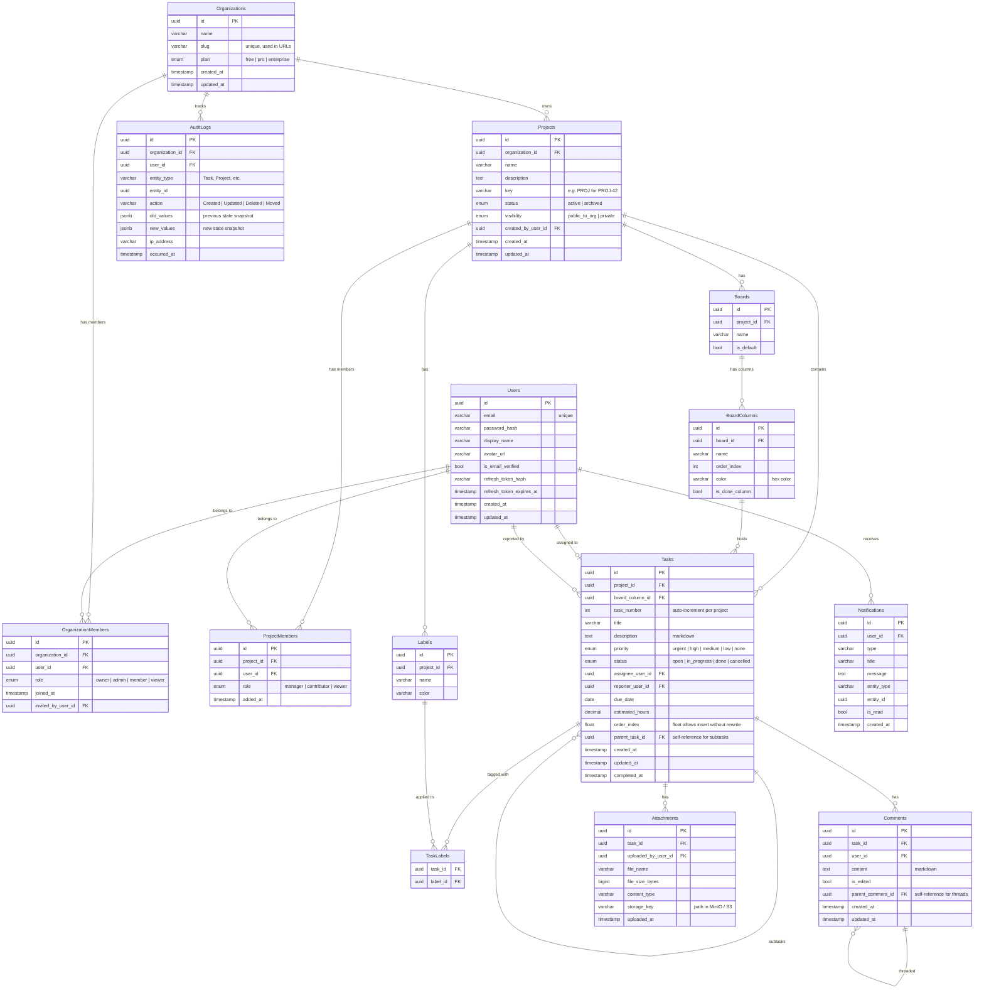

# Database - Entity Relationship Diagram

## Full ERD

---

## Design Decisions

### Why UUIDs instead of integers as primary keys?

- **Security:** Sequential integers (`/tasks/1`, `/tasks/2`) let attackers enumerate resources. UUIDs are unguessable.
- **Distributed systems:** If you ever split into microservices or sync data between systems, UUIDs don't clash. Integers do.
- **Import/export:** Moving data between environments doesn't cause ID conflicts.

**Downside:** Slightly larger storage, slightly slower index lookups. Acceptable tradeoff for most systems.

### Why `order_index` is a float?

If you store order as integers (1, 2, 3, 4) and you insert between 2 and 3, you have to renumber every item after position 2. With floats, inserting between 2 and 3 becomes 2.5. Between 2 and 2.5 becomes 2.25. You only renumber when precision runs out (very rarely).

### Why JSONB for `old_values` / `new_values` in AuditLogs?

The alternative is a separate audit table for every entity. That's 15+ tables just for audit history. With JSONB, one `audit_logs` table captures any entity's state as a snapshot. PostgreSQL's JSONB is indexed and queryable — you can `WHERE old_values->>'status' = 'open'`.

### Why `task_number` is a separate integer?

Users need human-readable task codes like `PROJ-42`. If you use the UUID as the task identifier in the UI, it's unusable. The `task_number` auto-increments per project (not globally), so each project has its own sequence: PROJ-1, PROJ-2... API-1, API-2...

### Why `refresh_token_hash` and not plain refresh token?

If someone gets read access to your database (SQL injection, backup leak), they get all refresh tokens and can impersonate every user. Storing the hash means the plain token is never at rest. Same principle as password hashing.
