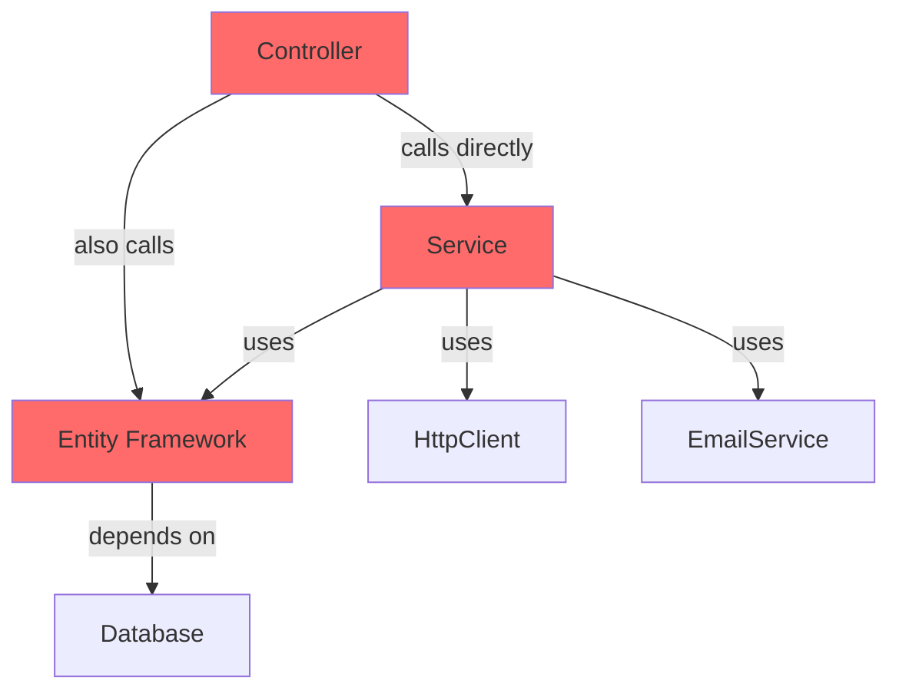
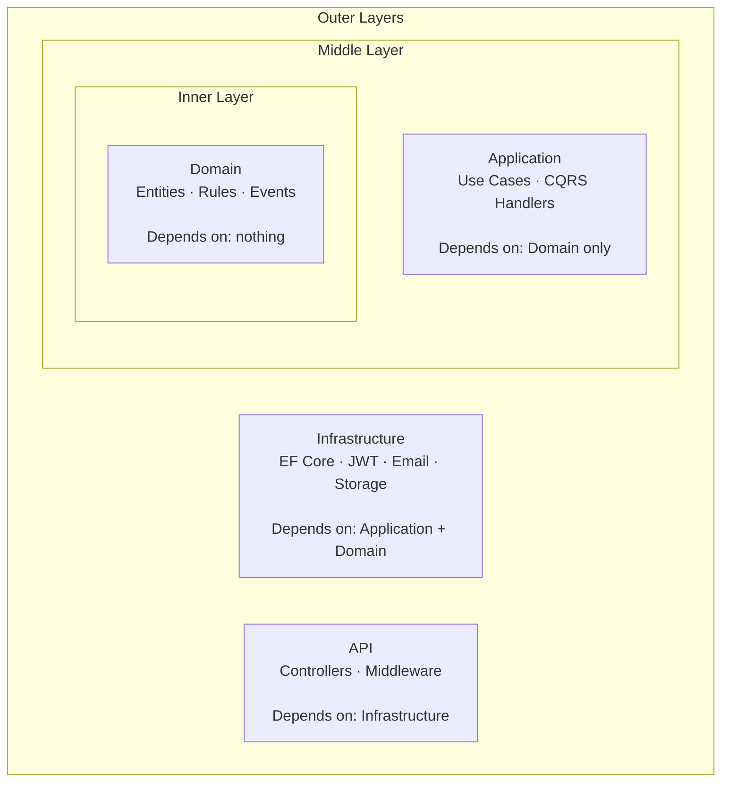
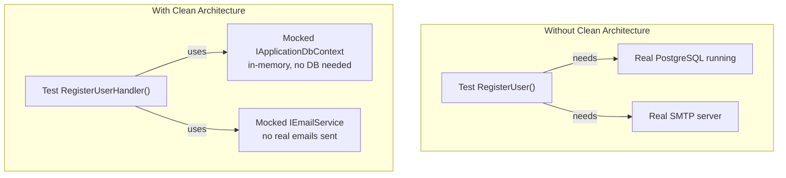
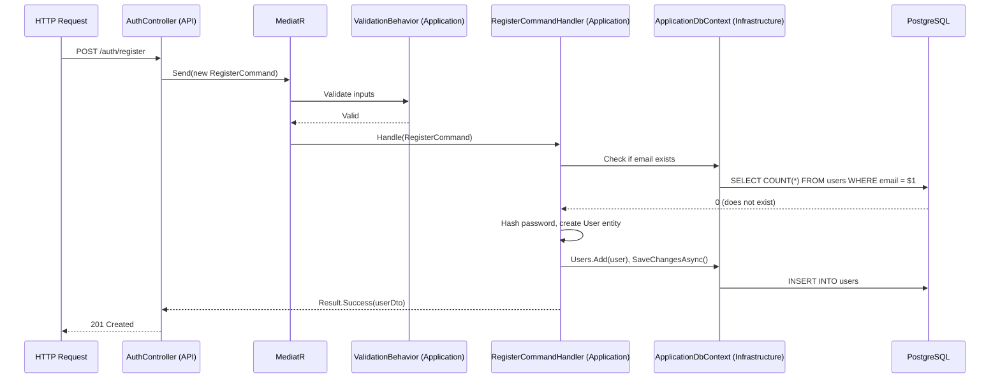
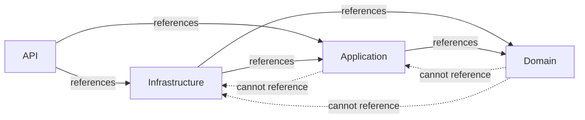

# Clean Architecture — Learning Notes

## The Problem It Solves

Imagine a typical project after 2 years without architecture:



Problems:
- To test the business logic, you need a real database running
- To change from EF Core to Dapper, you touch 30 files
- To understand what `TaskService.cs` does, you have to read 800 lines
- Developers don't know where to put new code

**Clean Architecture solves this by enforcing a strict dependency rule.**

---

## The Dependency Rule

**Dependencies only point inward. Never outward.**



The Domain layer compiles with zero NuGet packages. It is pure C#.

---

## The 4 Layers Explained

### Layer 1: Domain
**What lives here:** Entities, Domain Events, business rules, interfaces that Infrastructure must implement.

**Key rule:** Zero external dependencies. No EF Core. No HTTP. Nothing.

```csharp
// Domain/Entities/User.cs
// No "using Microsoft.EntityFrameworkCore" here — ever
public class User : BaseEntity
{
    public string Email { get; private set; }

    public void SetRefreshToken(string hash, DateTime expiresAt)
    {
        RefreshTokenHash = hash;
        RefreshTokenExpiresAt = expiresAt;
    }
}
```

### Layer 2: Application
**What lives here:** CQRS commands and queries, handlers, DTOs, validators, interfaces for services.

**Key rule:** Depends only on Domain. Talks to the database through an `IApplicationDbContext` interface defined here and implemented in Infrastructure.

```csharp
// Application defines the interface...
public interface IApplicationDbContext
{
    DbSet<User> Users { get; }
    Task<int> SaveChangesAsync(CancellationToken ct);
}

// Infrastructure implements it
public class ApplicationDbContext : DbContext, IApplicationDbContext { ... }
```

### Layer 3: Infrastructure
**What lives here:** EF Core, JWT, file storage, email, SignalR, any external system.

**Key rule:** Implements interfaces from Application. The rest of the system never knows what is behind those interfaces.

### Layer 4: API
**What lives here:** Controllers, Middleware, Program.cs.

**Key rule:** Thin layer. Controllers just receive HTTP, send a MediatR command, return the result. Zero business logic.

---

## Why This Matters: Testing



Unit tests run in milliseconds with no external dependencies. You mock the interfaces. The handler only sees the interface — it cannot tell if it is talking to PostgreSQL or a fake in-memory implementation.

---

## The Flow of a Request



The Controller knows nothing about the database. The Handler knows nothing about HTTP. Each layer only does its job.

---

## Project References Enforce the Rule at Compile Time



If you try to use EF Core in the Domain project, it will not compile. There is no package reference for it. The architecture is enforced by the compiler.

---

## Common Mistakes

| Mistake | Why it breaks the rule |
|---|---|
| Calling DbContext from a Controller | Controller bypasses Application layer |
| Importing HttpContext in a Handler | Application layer depends on HTTP infrastructure |
| Putting `[Required]` on a Domain entity | Domain depends on a framework annotation |
| Business logic inside a Controller | Logic that should be testable is hidden in HTTP layer |

---

## Interview Questions

**"Can you explain Clean Architecture?"**
> "It organizes code in layers where dependencies only point inward. The Domain layer has zero external dependencies — it is pure C#. Application contains use cases and depends only on Domain. Infrastructure implements interfaces defined in Application. This means business logic is testable without a running database, and you can swap implementations without changing business rules."

**"Why use 4 projects instead of one?"**
> "Project references enforce architectural boundaries at compile time. If everything is in one project, nothing stops a developer from using DbContext directly in a controller. Separate projects make violations impossible to build."

**"What is the Dependency Rule?"**
> "Dependencies only point inward. Domain knows nothing about EF Core. Application knows nothing about HTTP. This is enforced at compile time — the Domain project cannot import Entity Framework because there is no package reference for it."

---

## My Notes (write in your own words)

> After building Phase 1 and 2, come back and fill this in:
>
> - Before Clean Architecture, where did I put business logic?
> - What is the hardest habit to break?
> - My own analogy for the dependency rule:
