# Entity Framework Core — Learning Notes

## What is an ORM?

Before understanding DbContext, you need to understand what EF Core is.

**ORM = Object-Relational Mapper.**

A database stores data in tables with rows and columns.
C# works with objects (classes with properties).
These two worlds don't speak the same language.

An ORM is the translator between them:

```mermaid
graph LR
    CS["C# World\n─────────\nUser class\nList of Users\nuser.Email"]
    ORM["EF Core\n(the translator)"]
    DB["Database World\n─────────\nusers table\nrows of data\nemail column"]

    CS <-->|"translates"| ORM
    ORM <-->|"SQL queries"| DB
```



Without EF Core you'd write raw SQL:
```sql
INSERT INTO users (id, email, password_hash) VALUES (@id, @email, @hash);
SELECT * FROM users WHERE email = @email;
```

With EF Core you write C#:
```csharp
_context.Users.Add(user);
await _context.SaveChangesAsync();

var user = await _context.Users.FirstOrDefaultAsync(u => u.Email == email);
```

EF Core generates the SQL for you.

---

## What is DbContext?

**DbContext is the bridge between your C# code and the database.**

Think of it as a combination of three things:

```mermaid
graph TD
    DBC["ApplicationDbContext"]

    DBC --> A["1. Connection Manager\n────────────────\nKnows the connection string\nManages opening/closing connections\nHandles transactions"]
    DBC --> B["2. Table Registry\n────────────────\nDbSet<User> = users table\nDbSet<Project> = projects table\nOne DbSet per entity"]
    DBC --> C["3. Change Tracker\n────────────────\nWatches what you add/modify/delete\nOn SaveChanges() sends the SQL\nOnly saves what actually changed"]
```



In this project:

```csharp
public class ApplicationDbContext : DbContext
{
    // Table Registry — one DbSet per table
    public DbSet<User> Users => Set<User>();

    // (later we'll add more)
    // public DbSet<Project> Projects => Set<Project>();
    // public DbSet<Task> Tasks => Set<Task>();
}
```

---

## How does EF Core know the table structure?

EF Core needs to know:
- What table name to use
- Which columns exist
- Which are required
- Which have unique constraints

You tell it via **Entity Configuration** (Fluent API):

```mermaid
graph LR
    Entity["User.cs\n(Domain layer)\n────────────\nId\nEmail\nPasswordHash\nDisplayName"]

    Config["UserConfiguration.cs\n(Infrastructure layer)\n────────────────────────\ntable name = 'users'\nemail: max 255, unique\npassword: max 500\ndisplay name: max 100"]

    DB["PostgreSQL\n────────────\nusers table\nwith constraints\nand indexes"]

    Entity -->|"configured by"| Config
    Config -->|"EF Core generates SQL"| DB
```



**Why Fluent API instead of attributes on the class?**

You could do this:
```csharp
// With attributes — puts infrastructure concerns in the Domain layer ❌
public class User
{
    [MaxLength(255)]
    [Required]
    public string Email { get; set; }
}
```

But the Domain layer should know nothing about the database.
With Fluent API, all database mapping stays in Infrastructure where it belongs.

---

## The full EF Core architecture in this project


---

## What is a Migration?

A migration is a **snapshot of a change to your database schema**, stored as C# code.


The migration file has two methods:
- `Up()` — applies the change (create table, add column, etc.)
- `Down()` — reverts the change (drop table, remove column, etc.)

This means you can roll back database changes. Like Git, but for database schema.

**Why not just let EF Core modify the database automatically?**
In production you need control. You review migrations before running them. You can add seed data. You can modify the generated SQL if needed.

---

## How a query flows through the system

When a handler does `await _context.Users.FirstOrDefaultAsync(u => u.Email == email)`:


When a handler does `_context.Users.Add(user)` then `await _context.SaveChangesAsync()`:


---

## The Change Tracker — understanding the states

Every entity tracked by EF Core has a state:


`SaveChangesAsync()` only generates SQL for entities in `Added`, `Modified`, or `Deleted` state. Entities in `Unchanged` are ignored — no unnecessary SQL.

---

## Key concepts to know cold

| Concept | One-line definition |
|---|---|
| ORM | Translates between C# objects and database tables |
| DbContext | The class that manages the connection, tables (DbSets), and change tracking |
| DbSet\<T\> | Represents a table — lets you query and manipulate rows as C# objects |
| Fluent API | Code in `Configure()` that tells EF Core how to map an entity to a table |
| Migration | A versioned C# file describing a schema change, with Up() and Down() |
| Change Tracker | Watches entity states (Added/Modified/Deleted) and batches SQL on SaveChanges |
| LINQ to SQL | EF Core translates C# LINQ queries (.Where, .FirstOrDefault, etc.) to SQL |

---

## Interview questions on this topic

**"What is Entity Framework Core?"**
> "It's an ORM — it maps C# classes to database tables and translates LINQ queries to SQL. It also handles migrations to version-control schema changes."

**"What is a DbContext?"**
> "It's the central class in EF Core. It manages the database connection, exposes DbSets (one per table), and tracks changes to entities. When you call SaveChangesAsync, it generates and executes SQL for everything that changed."

**"What is a migration?"**
> "A migration is a versioned file that describes a schema change — like a Git commit but for the database. It has an Up() method that applies the change and a Down() method that reverts it. This lets you evolve the database schema safely and roll back if needed."

**"Why do you use Fluent API instead of data annotations?"**
> "Data annotations would put database concerns (MaxLength, Required) directly on Domain entities, which violates Clean Architecture. With Fluent API, all mapping configuration lives in Infrastructure, keeping the Domain layer free of any EF Core dependency."

---

## 📝 My notes (fill this in your own words)

> After working with DbContext for the first time, write here:
> - What confused you initially
> - The moment it clicked
> - Your own analogy for explaining DbContext to someone else
