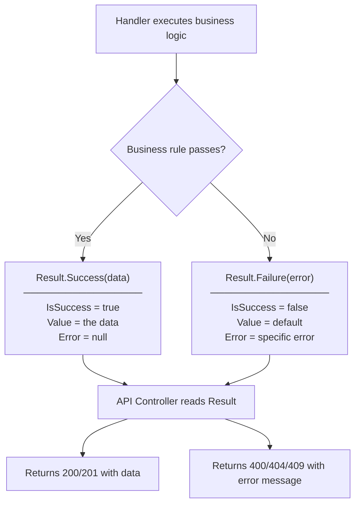
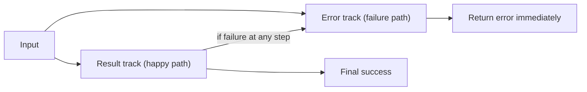

# Result Pattern — Learning Notes

## The Problem

How do you handle a "business failure" — like "email already exists" or "user not found"?

**Option 1: Throw an exception**
```csharp
public async Task<UserDto> Register(string email, string password)
{
    if (await EmailExists(email))
        throw new Exception("Email already in use"); // ❌
}
```

Problems:
- Exceptions are expensive (stack trace generation)
- Exceptions are for *unexpected* failures — "email already exists" is expected
- The caller has no idea what exceptions to expect unless they read the implementation
- Forces try/catch everywhere

**Option 2: Return null**
```csharp
public async Task<UserDto?> Register(string email, string password)
{
    if (await EmailExists(email))
        return null; // ❌ but WHY did it fail? We don't know
}
```

Problem: caller gets `null` with no information about what went wrong.

**Option 3: Result Pattern (chosen)**
```csharp
public async Task<Result<UserDto>> Register(string email, string password)
{
    if (await EmailExists(email))
        return Result.Failure<UserDto>(UserErrors.EmailAlreadyInUse); // ✅

    var user = CreateUser(email, password);
    return Result.Success(UserDto.From(user)); // ✅
}
```

The caller gets either a success with data, or a failure with a specific error. No exceptions for business rules. No ambiguous nulls.

---

## How It Works



---

## The Implementation in This Project

```csharp
// Domain/Common/Result.cs

public class Result<T>
{
    public bool IsSuccess { get; }
    public bool IsFailure => !IsSuccess;
    public T? Value { get; }
    public Error Error { get; }

    private Result(T value)
    {
        IsSuccess = true;
        Value = value;
        Error = Error.None;
    }

    private Result(Error error)
    {
        IsSuccess = false;
        Value = default;
        Error = error;
    }

    public static Result<T> Success(T value) => new(value);
    public static Result<T> Failure(Error error) => new(error);
}

// Domain/Common/Error.cs

public record Error(string Code, string Message)
{
    public static readonly Error None = new(string.Empty, string.Empty);
}
```

Errors are defined as constants, not magic strings:
```csharp
// Application/Features/Auth/AuthErrors.cs
public static class AuthErrors
{
    public static readonly Error EmailAlreadyInUse =
        new("auth.email_already_in_use", "An account with this email already exists.");

    public static readonly Error InvalidCredentials =
        new("auth.invalid_credentials", "Email or password is incorrect.");
}
```

---

## How the Controller Uses It

```csharp
[HttpPost("register")]
public async Task<IActionResult> Register(RegisterRequest request)
{
    var result = await _mediator.Send(new RegisterCommand(request.Email, request.Password));

    // Clean pattern: no try/catch needed
    if (result.IsFailure)
        return BadRequest(new { error = result.Error.Code, message = result.Error.Message });

    return CreatedAtAction(nameof(GetMe), result.Value);
}
```

---

## Result vs Exceptions — When to Use Each

| Scenario | Use |
|---|---|
| Email already exists | `Result.Failure(AuthErrors.EmailAlreadyInUse)` |
| User not found | `Result.Failure(UserErrors.NotFound)` |
| Insufficient permissions | `Result.Failure(AuthErrors.Forbidden)` |
| Database is down | `throw new Exception(...)` — this IS unexpected |
| Null reference bug | `throw new NullReferenceException(...)` — always unexpected |

**Rule:** If a user action *can* trigger this failure in normal usage → Result.
**Rule:** If this failure means something is broken in the system → Exception.

---

## In Other Projects

This pattern is also called:
- **Railway-Oriented Programming** (functional programming world)
- **Either monad** (Haskell, Scala)
- **OneOf** (another .NET library)
- **FluentResults** (a popular .NET library that does the same)

The concept is universal. The implementation varies, but the idea is always the same: **encode success and failure in the return type, not in exceptions.**



---

## Interview Questions

**"How do you handle errors in your application?"**
> "I use the Result pattern for expected business failures. Instead of throwing exceptions for things like 'email already in use', the handler returns a Result object that is either a success with data or a failure with a typed error. The controller reads the result and maps it to the appropriate HTTP status code. Exceptions are reserved for truly unexpected failures like database connectivity issues."

**"What is the difference between a business error and an exception?"**
> "A business error is an expected outcome of the system — the user did something the system cannot fulfill given the current state, like trying to register with an existing email. An exception is for unexpected system failures — things that indicate a bug or infrastructure problem. Mixing them causes the calling code to have try/catch blocks for both, which makes the code unclear."

---

## My Notes (write in your own words)

> After implementing your first handler using Result\<T\>:
>
> - Before this pattern, how did you handle errors in controllers or services?
> - What is cleaner about this approach in your opinion?
> - Can you explain Result\<T\> to a junior developer in 2 sentences?
